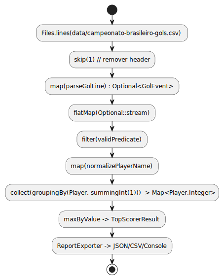

# brasileirao-analytics

> **Análise do Campeonato Brasileiro (2003–2022)**

**Resumo**

Projeto em **Java 17** para ler os arquivos CSV do Campeonato Brasileiro (2003–2022) e gerar relatórios/indicadores estatísticos como: time com mais vitórias em 2008, jogador com mais gols totais, jogador com mais gols de pênalti, jogador com mais gols contra, jogador com mais cartões amarelos/vermelhos, partida com maior número de gols, e outros.

O foco técnico do projeto inclui: **Clean Architecture**, **Programação Funcional** (Streams, Optional, interfaces funcionais), **IO/NIO.2** (Files + Streams), **Programação Paralela/Assíncrona** (`parallelStream`, `CompletableFuture`, `ExecutorService`) e boas práticas de performance (streaming, processadores concorrentes, coletores concorrentes).

---

## Sumário

* [Dataset](#dataset)
* [Funcionalidades](#funcionalidades)
* [Pré-requisitos](#pré-requisitos)
* [Instalação e execução](#instalação-e-execução)
* [Exemplos de uso (CLI)](#exemplos-de-uso-cli)
* [Estrutura do repositório](#estrutura-do-repositório)
* [Arquitetura e decisões técnicas](#arquitetura-e-decisoes-tcnicas)
* [Design das análises](#design-das-anlises)
* [Testes](#testes)
* [Contribuição](#contribuição)
* [Licença](#licença)

---

## Dataset

Os arquivos CSV usados por este projeto vêm do repositório público `ada_brasileirao_dataset` (contém arquivos como `campeonato-brasileiro-full.csv`, `campeonato-brasileiro-gols.csv`, `campeonato-brasileiro-cartoes.csv`, `campeonato-brasileiro-estatisticas-full.csv`, entre outros).

> **Atenção:** não comite arquivos CSV grandes no repositório. Neste projeto, espera-se que o usuário baixe os CSVs e coloque-os na pasta `data/` antes de executar o programa.

**Formato esperado:** CSV com header, codificação UTF-8 (ou configurável via parâmetro), separador `,` (configurável). Caso os CSVs do dataset tenham diferenças, ajuste o parser/colunas.

---

## Funcionalidades

O projeto gera (entre outros) os seguintes relatórios:

1. Time que mais venceu jogos em um ano específico (ex.: 2008)
2. Estado (UF) que teve menos jogos no período 2003–2022
3. Jogador que mais fez gols (total)
4. Jogador que mais fez gols de pênalti
5. Jogador que mais fez gols contra (próprio gol)
6. Jogador que mais recebeu cartões amarelos
7. Jogador que mais recebeu cartões vermelhos
8. Placar da partida com mais gols (e detalhes da partida)

As saídas podem ser: `json`, `csv` ou tabela formatada no console.

---

## Pré-requisitos

* Java 17 (JDK 17)
* Gradle wrapper incluído (`./gradlew`) — instalação de Gradle não obrigatória
* Espaço suficiente para os CSVs (poucos MB, dependendo do dataset)

---

## Instalação e execução

1. Clone este repositório:

```bash
git clone https://github.com/seu-usuario/brasileirao-analytics.git
cd brasileirao-analytics
```

2. Baixe os CSVs do dataset e coloque-os em `data/` (mesma raiz do projeto). Exemplo de arquivos esperados:

```
data/campeonato-brasileiro-full.csv
data/campeonato-brasileiro-gols.csv
data/campeonato-brasileiro-cartoes.csv
data/campeonato-brasileiro-estatisticas-full.csv
```

3. Build com Gradle wrapper:

```bash
# Linux / macOS
./gradlew clean build

# Windows (PowerShell)
./gradlew.bat clean build
```

4. Executar o JAR gerado (exemplo: executar todos os relatórios):

```bash
java -jar build/libs/brasileirao-analytics-all.jar --data-dir data/ --report all --output-format json
```

---

## Exemplos de uso (CLI)

Exemplos de execução (substitua `build/libs/brasileirao-analytics-all.jar` pelo JAR gerado no seu build):

* Time que mais venceu em 2008 (formato tabela):

```bash
java -jar build/libs/brasileirao-analytics-all.jar --data-dir data/ --report most-wins --year 2008 --output-format table
```

* Jogador com mais gols (JSON):

```bash
java -jar build/libs/brasileirao-analytics-all.jar --data-dir data/ --report top-goals --output-format json
```

* Estado com menos jogos entre 2003 e 2022 (CSV):

```bash
java -jar build/libs/brasileirao-analytics-all.jar --data-dir data/ --report least-plays-by-state --from 2003 --to 2022 --output-format csv
```

### Opções do CLI (sugeridas)

```
--data-dir <pasta>        Diretório com CSVs (default: data/)
--report <nome>          Nome do relatório (most-wins, least-plays-by-state, top-goals, top-penalties, top-owngoals, top-yellow-cards, top-red-cards, highest-scoring-match, all)
--year <ano>             Ano (quando aplicável)
--from <ano>             Ano inicial para intervalos (ex.: 2003)
--to <ano>               Ano final para intervalos (ex.: 2022)
--output-format <fmt>    json | csv | table (default: json)
--parallel <true|false>  usar processamento paralelo (default: true)
--encoding <enc>         codificação dos CSVs (default: UTF-8)
--help                   exibe ajuda
```

---

## Estrutura do repositório (sugerida)

```
/src
  /main
    /java
      /br/com/seuprojeto
         application        # Adaptadores de I/O, CLI, DTOs
         domain             # Entidades, ValueObjects, Interfaces (ports)
         usecase            # Casos de uso (interactors)
         infrastructure     # Implementações de leitura CSV (NIO.2), repositórios
  /test                  # Testes unitários e de integração
/data                    # (não commitado) CSVs do dataset
/build                   # Gradle build output
/README.md
/LICENSE
```

---

## Arquitetura e decisões técnicas

### Clean Architecture

* **Domain**: regras de negócio puras — entidades como `Match`, `PlayerEvent`, `TeamStats` e interfaces (ports) para leitura de dados.
* **Use Cases**: classes que orquestram as análises (`MostWinsInYearUseCase`, `TopScorerUseCase`, `LeastPlaysByStateUseCase`).
* **Infrastructure / Adapters**: leitura dos CSVs via NIO.2 (`Files.lines(Path)`), parsers robustos (validação e `Optional`), adaptadores de saída (JSON/CSV/Console) e implementação de repositórios.

### Diagrama de Componentes


### Leitura de CSV

* Usar `Files.lines(Path)` para trabalhar com `Stream<String>` e garantir processamento lazy.
* Parser responsável por transformar cada linha em um DTO/entidade, retornando `Optional<T>` para lidar com linhas inválidas.
* Uso de `Collectors` (`groupingBy`, `summingInt`, `toConcurrentMap`) para agregações eficientes.

### Pipeline de Processamento CSV


### Programação Funcional & Optional

* Uso intenso de `Stream`, `Collectors`, `Optional`, `Function`, `Predicate` e outras interfaces funcionais para manter código conciso e testável.

### Diagrama de composição funcional


### Paralelismo & Assincronia

* `parallelStream()` para coletores que escalam bem; `CompletableFuture` para executar relatórios independentes em paralelo; `ExecutorService` configurável pelo usuário.
* Ao usar paralelismo, preferir coletores concorrentes e estruturas thread-safe. Evitar mutações compartilhadas sem sincronização.

---
### Diagrama de Sequencia Paralelismo


## Design das análises (exemplo conceitual)

**Exemplo (Top Scorer - pseudocódigo):**

```java
try (Stream<String> lines = Files.lines(golsCsvPath)) {
    Map<String,Integer> goalsByPlayer = lines
        .skip(1)
        .map(line -> parseGolEvent(line)) // Optional<GolEvent>
        .flatMap(Optional::stream)
        .collect(Collectors.groupingBy(
            GolEvent::getPlayerName,
            Collectors.summingInt(GolEvent::getCount)
        ));

    Optional<Entry<String,Integer>> top = goalsByPlayer.entrySet().stream()
        .max(Entry.comparingByValue());

    top.ifPresent(...);
}
```

Para processamentos maiores é recomendável usar `collect(Collectors.toConcurrentMap(...))` quando `parallel()` estiver ativado.

---
### Diagrama de tratamento de erro (parse com Optional)


## Testes

* Unit tests para parsers (CSV -> DTOs) e para cada use case.
* Integration tests com amostras reduzidas dos CSVs em `src/test/resources`.
* Recomenda-se JUnit 5 + Mockito.

---

## Contribuição

1. Abra uma *issue* descrevendo a proposta/bug.
2. Crie um branch `feature/descricao`.
3. Faça um PR com descrição clara, testes e documentação atualizada.

Sugestões de validação contínua (CI): GitHub Actions rodando `./gradlew build` e `./gradlew test` em cada PR.

---

## Boas práticas e notas

* Não commitar o dataset completo: use submódulo, release, ou instruções de download.
* Documente suposições sobre colunas/flags do CSV (por ex.: como identificar gols contra, pênaltis, cartões).
* Contabilize e logue linhas inválidas para análise posterior.
* Preferir coletores que limitem memória quando possível (ex.: top-k streaming).

---

## Licença

Este repositório é distribuído com licença **MIT**. Inclua um arquivo `LICENSE` com o texto completo da MIT License e preencha `[YEAR]` e `[OWNER]` conforme apropriado.

---

## Próximos passos que posso gerar para você

* Gerar o arquivo `LICENSE` com a MIT License preenchida com seu nome/organização.
* Gerar `build.gradle` e esqueleto de `Main` e alguns Use Cases em Java 17.
* Gerar parsers exemplo para os CSVs (snippets reais).

Se quiser que eu gere o arquivo `LICENSE` agora, diga o nome (ou organização) que deve aparecer como proprietário e o ano — eu já crio o arquivo pronto para commit.
